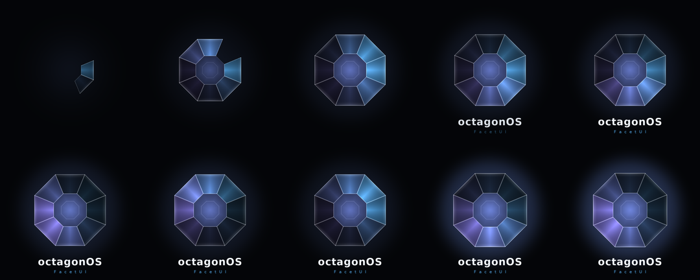

# octagonOS

An operating system built on **FacetUI**, a glass design language.

Two editions, one design. Everything platform-neutral — the shader maths, the
palette, the glyphs, the doctrine — lives in [`shared/`](shared/) and is
imported by both, so the two cannot drift apart.

| | | |
|---|---|---|
| [**`mobile/`**](mobile/) | An Android 17 GSI, for phones with physical keyboards and for slabs, from one image | **Beta. Verified, never run** |
| [**`desktop/`**](desktop/) | An Ubuntu-based Linux distribution carrying the same design language | **Started. Boot splash, compositor effect, Plasma style and icon theme built and run** |
| [**`shared/`**](shared/) | The FacetUI core both editions import | — |

*The boot animation, rendered by evaluating FacetUI's own shader maths — the
same maths in `shared/facetui`.*

## Status

**Nothing has run on a phone.** No device, no emulator, no image built. What
*has* been built and checked is in
[`mobile/docs/status.md`](mobile/docs/status.md), which is the ledger and is
kept honest: nothing else in the repository claims more than it does.

The single largest risk was retired late: **both AGSL shaders now compile**
under Skia's own SkSL compiler, offline. That was the one failure that would
have surfaced as a blank screen after a multi-hour build.

**The desktop edition boots.** A live ISO was built, and on booting it KWin
reported `facetui-glass is loaded and running` on an OpenGL scene, with its
own blur loaded beside it as a control and all three FacetUI theme keys in
force — the full report is in
[`desktop/iso/evidence/`](desktop/iso/evidence/). Two qualifications travel
with that, and the evidence README leads with them rather than burying them:
the test machine has no GPU, so OpenGL had to be **forced** (Mesa's software
rasteriser tells KWin not to use it, and KWin then loads no OpenGL effect at
all), and every frame was drawn by the CPU; and it proves the effect *runs*,
not that the glass *looks right* — QEMU cannot photograph the guest's Wayland
output, so no picture was taken. Appearance is settled offline instead.

The [Plymouth boot splash](desktop/plymouth/) was installed against a real
`plymouthd`, driven with real keystrokes and screenshotted — including the
encrypted-disk passphrase path, which is the part of a boot theme that ruins a
machine when it is wrong. The [KWin glass effect](desktop/kwin/) compiles
against KWin 6.7.5, and its shader is checked against
`shared/facetui/facet_math.py` to 1.7e-07 in a real GL driver — so the boot
screen, the shade, the app icons and now the desktop's panels are provably lit
by one piece of maths.

Both were written, read carefully, and still wrong in ways only running them
showed — a theme that drew its background and stopped, sprites silently
discarded, a callback that never fires, a shader signature that changed between
KWin releases. Each is written down where its fix lives.

## Why this is one repository

`mobile` and `desktop` are two products, not two versions of one thing, so
branches were the wrong shape — they would never merge, and `shared/` would
have to be cherry-picked between them forever.

As directories, `facet_math.py` is one file. When a shader constant changes,
both editions change with it. This project keeps claiming its boot screen, its
shade and its app icons are lit by the same maths; the layout is what makes that
true rather than aspirational, and
[`mobile/tools/validate-shaders.py`](mobile/tools/validate-shaders.py) checks
the copies that genuinely cannot be shared — the Kotlin and Java ones inside the
patches.

## Start here

- [`shared/docs/design-language.md`](shared/docs/design-language.md) — the rule,
  the depth model, and the doctrine
- [`mobile/README.md`](mobile/README.md) — the Android edition
- [`desktop/README.md`](desktop/README.md) — the Linux edition, and the
  KWin/Plasma-on-Wayland decision behind it

## Credit

FacetUI originates in
[titan2e-eos](https://github.com/hayliewordsman/titan2e-eos), where it was
designed against Android 16, along with the rule that governs it:

> On a blurred surface, any effect that works by **displacing samples** is
> invisible. Only effects that **modify values** survive the blur.

## Licence

Apache 2.0. See [LICENSE](LICENSE).
