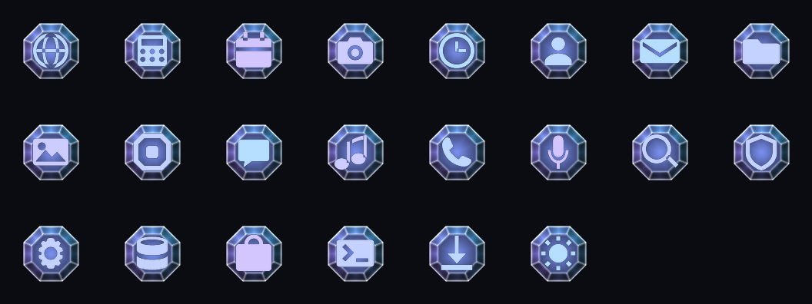

# octagonOS

An Android 17 GSI built on **FacetUI**, a glass design language, for phones with
**physical keyboards** and for **slabs** — from one image.


*The boot animation, rendered by evaluating FacetUI's own shader maths.*



*App icons, from the same maths. Every app gets these, not just the ones drawn
here — see [Icons](#icons-every-app-not-a-list).*

## Status — read this first

**Beta, and nothing here has run on a phone.** No device, no emulator, no image
built. What *has* been built and checked is listed below; the full ledger,
including everything that has not, is in **[docs/status.md](docs/status.md)**.

| Piece | State |
|---|---|
| Boot animation | **Built and verified.** 8.9 MiB, 92 frames, all checks pass |
| SystemUI patches (3) | **Apply cleanly** to a pristine `lineage-24.0` tree. Never compiled |
| Keyboard glass patch | **Applies cleanly** to a pristine LatinIME tree. Never compiled |
| RRO overlays (4) | Sources **validate** against their target trees. Never built — no SDK here |
| Icon engine patch | **Applies cleanly** to a pristine icon-loader tree. Never compiled |
| Popup glass patch | **Applies cleanly**, alone and alongside the SystemUI three. Never compiled |
| Icon pack | **Generated and verified.** 22 icons, 40 components, all checks pass. Never packaged — no SDK here |
| Form-factor detection | **7/7 tests pass**, against synthetic bitmasks |
| The AGSL shaders | **Both compile** under Skia's SkSL compiler. Not yet Android's own |
| The GSI itself | **Not built.** Needs 250–400 GB |

Base is `lineage-24.0`, confirmed Android 17 by
`Build.VERSION_CODES.CINNAMON_BUN == 37` in the tree itself, not by assumption.

## What FacetUI reaches

Glass is applied as a system, not a theme — the point is that surfaces at the
same visual depth are the same material, even where Android gives them
unrelated resource names.

| Surface | How | Tier |
|---|---|---|
| Notification shade | Blur radii, transparent scrim | overlay |
| **Push notifications** | `notification_background_blur_radius` | overlay |
| **Lockscreen** | Shortcut and fingerprint blur | overlay |
| **Homescreen** | Folder, popup and organizer blur, retuned to match the shade | overlay |
| **Virtual keyboard** | Translucent background **and** a blurred window | overlay **+** patch |
| Volume, power menu, bottom sheets | Pulled onto one depth tier | overlay |
| **Dialogs, system-wide** | Real blur, translucency and reduced dim, from two empty styles | overlay |
| **Popup and overflow menus** | Tint and hairline, plus real blur | overlay **+** patch |
| Shade edge and rim | Two AGSL shaders | patch |
| Status bar icons | Four modes, incl. a neutral privacy dot | patch |
| **App icons — all of them** | Octagonal mask, a curated pack, and a procedural wrap for everything else | overlay **+** pack **+** patch |
| Boot animation | Rendered from the same shader maths | generated |

Notifications and the lockscreen are overlays rather than patches because
**Android 17 exposes far more blur as resources than Android 16 did** — work
that needed a SystemUI recompile a release ago now does not. That finding, and
the three places Android 17 moved *against* us, are in
[docs/facetui.md](docs/facetui.md).

## Icons: every app, not a list

Before this, app icons were the one part of the system FacetUI did not reach —
a grid of unrelated circles and squircles sitting on a glass homescreen. Three
layers fix that, and only the middle one is a list:

**The shape.** `config_icon_mask` is a framework string that
`AdaptiveIconDrawable` parses into the clip path applied to *every* adaptive
icon on the device. Setting it to a regular octagon — corner cut
`100/(2+√2)`, all eight sides `41.421` — makes every icon octagonal at once,
system and third-party alike, with nothing done to any of them individually.

**The curated pack.** [`iconpack/`](iconpack/) renders purpose-drawn glyphs onto
a glass octagon generated from `facet_math.py`. 22 icons across 40 components.

**The engine.** [`patches/iconloader/0001`](patches/iconloader/0001-facetui-icon-glass.patch)
hooks the one method every icon load funnels through and recomposes anything the
pack does not curate — which is every app the user will ever install — onto the
same glass. **This is what makes the coverage total.** Without it the pack is a
list somebody has to keep extending; with it, the list is only an upgrade for
apps worth hand-drawing.

It builds a real `AdaptiveIconDrawable` rather than filtering the finished
bitmap, so masking, shadows and monochrome extraction keep working on FacetUI
icons exactly as they do on stock ones. For an app that already ships an
adaptive icon, only its *foreground* is taken — keeping its background would put
a coloured square inside the octagon; dropping it puts the app's own glyph on
FacetUI's surface, which is the point.

Details, including why the calendar and clock are deliberately excluded:
[docs/icons.md](docs/icons.md).

## Keyboards and slabs, from one image

A GSI cannot be built per device, and the difference is not knowable at build
time, so it is resolved on first boot: read the kernel's input table, look for
three full letter rows in a device's `KEY` capability bitmask, and set
`persist.octagonos.formfactor` to `keyboard` or `slab`.

Requiring all three rows is what separates a real keyboard from a volume rocker
— both advertise `EV_KEY`. The arithmetic is tested in
`tools/test-formfactor-detect.sh`, including a numeric keypad, a two-row
keyboard, and a bitmask that wraps negative in 64-bit shell arithmetic.

## Layout

| Path | What it is |
|---|---|
| [`bootanimation/`](bootanimation/) | The generator, and `facet_math.py` — FacetUI's AGSL transcribed to NumPy |
| [`overlay/`](overlay/) | Eight RRO overlays: SystemUI, framework, launcher, IME, and four apps |
| [`iconpack/`](iconpack/) | The icon generator, and the generated pack |
| [`patches/`](patches/) | Source patches for what resources cannot express |
| [`product/`](product/) | Product makefile, first-boot form-factor service |
| [`tools/`](tools/) | Verifiers — boot animation, overlays, icon pack, form-factor detection |
| [`docs/`](docs/) | [status](docs/status.md) · [FacetUI](docs/facetui.md) · [icons](docs/icons.md) · [app coverage](docs/app-coverage.md) · [building](docs/building.md) · [boot animation](docs/bootanimation.md) · [keyboards and slabs](docs/keyboards-and-slabs.md) |

## Quick start

```bash
bootanimation/build.sh        # builds and verifies; no Android SDK needed
SKIP_APK=1 iconpack/build.sh  # generates and verifies the icons; no SDK needed

tools/validate-overlays.py --systemui <frameworks/base> \
                           --launcher <Launcher3> --ime <LatinIME>
tools/test-formfactor-detect.sh

pip install skia-python        # plus libegl1 libgl1 on Linux
tools/validate-shaders.py      # compiles the AGSL; no SDK, no device
```

Full instructions, both tiers: [docs/building.md](docs/building.md).

## Five findings worth carrying forward

**A looping boot animation part is resident for the whole boot.**
`bootanimation` allocates a GL texture per frame for any part with `count != 1`
and frees them only when the animation ends. An unremarkable 84-frame loop at
1080×1080 would hold **374 MiB** of texture memory on a phone that has barely
mounted `/data`, with nothing to warn you. octagonOS's loop is 30 frames at
720×720 — 59 MiB — and the intro and outro are long because, at `count == 1`,
they are free. Read out of `BootAnimation.cpp`, not assumed.

**An overlay naming a resource its target does not define fails silently.** It
links, installs, and does nothing. `shade_panel_base`, which FacetUI overrode on
Android 16, does not exist on Android 17 — so
[`tools/validate-overlays.py`](tools/validate-overlays.py) checks every override
against the real tree. It also found that three tint overrides had become
redundant; those were deleted rather than kept as decoration.

**Translucent is not glass.** An RRO can make the keyboard translucent, but the
app behind then shows through unmodified, which reads as a tinted window.
Blurring what is behind is a window property, reachable only from code — so the
glass keyboard is deliberately half overlay, half patch, and **needs both**.

**Three unused attributes were already there.** `windowBackgroundBlurRadius`,
`windowBlurBehindEnabled` and `windowBlurBehindRadius` have existed since
Android 12, are read straight off a window's theme by
`PhoneWindow.generateLayout()`, and **no platform theme sets any of them**. Two
*empty* platform styles — `Theme.Material.Dialog` and its Light twin — carry
them down to every dialog variant in the system, so every dialog becomes real
glass with no code. A `PopupWindow` is not a `PhoneWindow` and has no blur API
at all, so no overlay can reach a menu — that needed a patch of its own, which
borrows `BackgroundBlurDrawable` from `DecorView` and sits it underneath the
popup's existing background.

**One glass, never two.** The icon engine loads its tile *out of the pack*
rather than generating its own, so a curated icon and a procedurally themed one
are the same asset and cannot drift. It also makes the dependency explicit: with
the pack absent the engine does nothing and icons stay stock, which is a
deliberate degrade rather than a half-themed system.

## Credit

FacetUI is from
**[titan2e-eos](https://github.com/hayliewordsman/titan2e-eos)**, where it was
designed against Android 16, along with the rule that governs it:

> On a blurred surface, any effect that works by **displacing samples** is
> invisible. Only effects that **modify values** survive the blur.

That repository's `tools/inject-ime.sh` is also what octagonOS uses to build
images, rather than shipping a second copy of the fiddly part.

## Licence

Apache 2.0. See [LICENSE](LICENSE).
