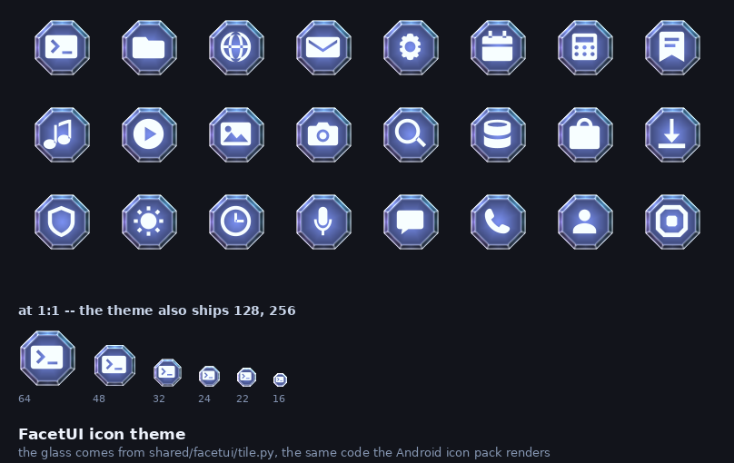

# The FacetUI icon theme

A freedesktop icon theme: the same glass octagon the Android icon pack draws,
with the same glyphs on it.



## One tile, two editions

The glass comes from
[`shared/facetui/tile.py`](../../shared/facetui/tile.py) — eight crown facets
around a flat table, rim-darkened, with a specular edge, lit from one fixed
angle so a grid of icons reads as one surface rather than a scatter of
unrelated buttons. The Android pack renders that same code as the background of
every adaptive icon.

The glyphs come from
[`shared/facetui/glyphs.py`](../../shared/facetui/glyphs.py), which both
editions already shared.

What is *not* shared is how much of the box the octagon fills. Android reserves
the outer edge of an adaptive icon for parallax bleed, so its tile covers two
thirds of the drawable; a desktop icon has no such reserve and covers 0.47 of
the box. That is a platform's geometry, not FacetUI's, so it is a parameter.

## Why PNG, and why every size is drawn

The glass is exponential falloffs — an edge highlight, a rim darkening, a
specular term over eight facets. A vector cannot express them, which is the
same reason the Android pack ships its tile as a raster.

Each size is **rendered**, not resampled. The specular edge does not scale
linearly, so a 16px icon downsampled from 256 is a grey smudge with a bright
rim. The theme ships 16, 22, 24, 32, 48, 64, 128 and 256.

## What it covers

124 names over 25 glyphs: the standard freedesktop names first — a
correctly-written application asks for `utilities-terminal`, not for its own
name — plus the application ids of programs a desktop tends to have, for the
ones that do not.

Everything else falls through `Inherits=breeze,hicolor`. That is the mechanism
the format provides and the honest answer: a theme claiming to have drawn every
icon in existence would be lying about roughly all of them.

## Building and installing

```sh
./make-icon-theme.py
cp -r FacetUI ~/.local/share/icons/
```

Then pick **FacetUI** in System Settings → Icons.

## Checking it

```sh
../tools/verify-icon-theme.py    # static: reads the theme
../tools/run-icon-theme.sh       # asks Qt to resolve every icon, and GTK
../tools/render-icon-sheet.py    # the sheet above
```

The running pass fetches all 124 names at all 8 sizes — 992 lookups — and
**compares each against the PNG this theme ships.** That comparison is the
whole point: the spec says an unresolvable name falls back, so a theme with a
broken `index.theme` resolves every icon perfectly, to somebody else's. It also
catches a declared `Size` that does not match its directory, because Qt would
then resolve the name from a different size.

`gtk-update-icon-cache` then validates the same theme through GTK's loader.

## What only measuring found

**Comparing pixmaps needs premultiplied alpha on both sides.** A `QPixmap`
holds premultiplied colour; converting it to plain `ARGB32` divides the colour
back out by the alpha, which is lossy wherever the alpha is partial. On an
octagon that is the entire antialiased rim, and it put the average difference
at 20/255 for icons that were pixel-identical in the middle.

**`QIcon::hasThemeIcon` cannot tell you an icon is yours.** It returns true for
one reached through `Inherits`, so a theme that defined nothing would pass it
for every name.

**Qt's default search paths come from `XDG_DATA_DIRS`,** which is unset in a
bare container — so the system themes are not on the list at all and the
inheritance check fails for want of a Breeze to inherit from. The probe derives
them from the spec's documented default instead of trusting the environment.

## The check that is specific to FacetUI

**Does the glyph still fit the glass?** The table is the calm centre a glyph
should sit on; the crown around it is eight facets of value variation that
makes a thin glyph unreadable. The Android pack shipped fifteen of its
twenty-five glyphs overhanging that boundary, and every other check stayed
green, because an overhanging glyph is not an error to anything.

The verifier measures it **on the shipped pixels** — rendering the bare tile at
the same size and subtracting — because the first version of that check
recomputed the generator's own arithmetic and was worthless: the glyph scale is
*derived* from the widest glyph, so the widest glyph always lands exactly at
the clearance and the comparison could never fail. It passed on every input,
including ones written to be rejected.

Measured: the widest glyph reaches 0.924 of the table radius, the same
clearance the Android pack ships.

## Files

| | |
|---|---|
| `make-icon-theme.py` | generates the theme |
| `FacetUI/index.theme` | the sizes, the contexts, and what it inherits |
| `FacetUI/apps/<size>/` | the icons |
| `../tools/icon-probe/` | the Qt harness the running pass uses |
