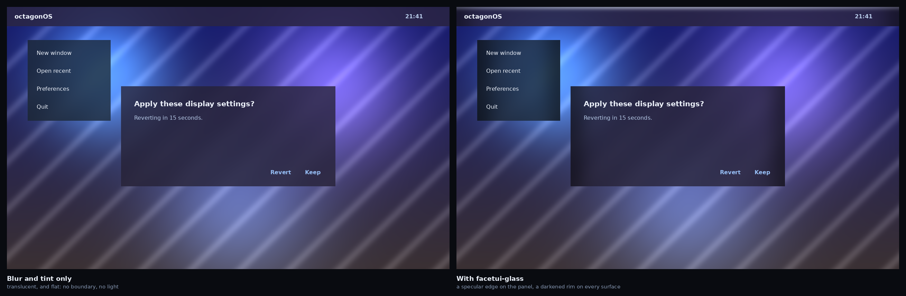

# FacetUI glass, for KWin

The two FacetUI shaders — the specular edge and the rim darkening — as a KWin
effect, so a panel, a menu or a dialog on octagonOS Desktop reads as a lit pane
of glass rather than a translucent grey rectangle.



Both halves are composited by `facetui-glass.frag` itself, in a real GL driver
— the shader that ships, not a model of it. The blur and the wallpaper are
stand-ins for KWin's.

## What this is not

**It does not blur.** KWin's own blur effect does that, and FacetUI's depth
model lives there and in the Plasma theme. This supplies the other two thirds
of the rule — the specular edge and the rim — which nothing in Plasma provides,
and which is what separates glass from translucency.

Three things must be true together: **blur**, **translucency**, and **a
boundary**. The left half of the picture has the first two.

## Which windows, and why

System surfaces only — docks, menus, dialogs, tooltips, notifications,
on-screen displays. Not application windows, and not the desktop.

That is the doctrine, not caution. A compositor can only work on what it
composites, which is a window. An application's toolbars, cards and list
backgrounds are drawn *inside* its window and are the application's to style.
Treating a whole app window as one pane would put a rim down the middle of its
content.

| Tier | Surfaces | Edge | Rim |
|---|---|---|---|
| `L4` | the panel | **yes** | yes |
| `L3` | notifications, OSDs | no | yes |
| `L2` | dialogs, menus, tooltips, combo boxes | no | yes |
| — | application windows, the desktop | — | — |

**Only the panel is lit.** This mirrors the Android edition exactly, where the
specular edge is drawn by `ScrimView` and therefore lands on the notification
shade's scrim alone. Lighting every surface was tried there, in the offline
render, and put a white bar across the top of every notification.

## Building

```sh
cmake -B build -DCMAKE_BUILD_TYPE=Release
cmake --build build
sudo cmake --install build
```

Then enable **FacetUI Glass** in System Settings → Desktop Effects, or set
`facetui-glassEnabled=true` under `[Plugins]` in `kwinrc`.

**This must be built against the KWin it will run on.** KWin's effect API is
explicitly not binary compatible across versions — its own header says so. For
a distribution that is not a problem: the effect is built from source against
the KWin in the same release. It is a reason not to ship a prebuilt binary and
expect it to keep working.

## What has been verified, and how

| | |
|---|---|
| The shader compiles | Under a real GLES 3 driver, with KWin's exact preamble |
| The shader is correct | Its output matches `shared/facetui/facet_math.py` to 1.7e-07 |
| The effect builds | Against KWin 6.7.5, KF6 6.30 and Qt 6.11 |
| KWin accepts the plugin | Qt reads it as `org.kde.kwin.EffectPluginFactory6.7.5`; KWin finds it and calls `supported()` |
| **The effect drawing in a compositing KWin** | **Not verified — needs a GPU** |

The last row is the honest one. Without a DRM render node KWin falls back to
its QPainter renderer, where OpenGL effects — including KWin's own blur — are
unsupported and never loaded. The effect declining there is correct behaviour,
and `desktop/tools/run-kwin-effect.sh` says so rather than calling it a pass.

```sh
desktop/tools/validate-kwin-shaders.py   # compiles it, and checks the maths
desktop/tools/run-kwin-effect.sh         # builds it, and starts a real KWin
desktop/tools/check-kwin-api.py          # fast; and see below
desktop/tools/render-kwin-glass.py       # the picture above
```

Every check was proved to fail on the mistake it targets before being trusted:
nine wrong shaders, eight wrong API uses, three broken plugins.

## Things that only a compiler or a running KWin said

**`drawWindow` returns `void` in KWin 6.7 and `bool` on master.** This was
written from master's headers and compiled against neither until the signature
matched the release being targeted. Hence `check-kwin-api.py`, which is worth
pointing at *both*: the KWin you ship on, and master, to find out what the next
release will break. It reports this difference today.

**`texcoord0` is not a position in the window.** KWin runs the quad's texture
coordinates through the offscreen texture's own matrix, so they are a position
in *texture* space and may be flipped. Deriving the edge distance from them
would put the highlight on whichever edge the texture happened to be stored
from — correct exactly half the time. The shader uses `position0` instead,
which is why the effect asks for the `RoundedCorners` trait: not to round
anything, but because that is what makes KWin's `base.vert` emit that varying.

**The quad is bigger than the window.** KWin builds it from the *expanded*
geometry — frame plus shadow — and `position0` is measured from the frame's
top-left, so it goes negative across the shadow. Both effects are even in `p`
(`exp(-d*d)` is the same for `-d`), so an ungated shader mirrors the specular
edge into the shadow and paints a bright band floating above the window. Hence
`facet_inside()`.

**A `--` inside an XML comment is illegal**, and `rcc` rejects the whole `.qrc`
for it. The same mistake was made in the Android overlays, where `aapt2`
rejected them for exactly the same reason.

**`metadata.json` must not set an `Id`.** KWin derives the plugin id from the
file name and logs a complaint about the key on every start. Found by reading
KWin's log, not by building.

## Files

| | |
|---|---|
| `shaders/facetui-glass.frag` | the two shaders, transcribed from the AGSL |
| `facetuiglasseffect.{h,cpp}` | which windows, which tier, which uniforms |
| `main.cpp` | the plugin factory |
| `metadata.json` | what System Settings shows |
| `CMakeLists.txt` | an out-of-tree build |
