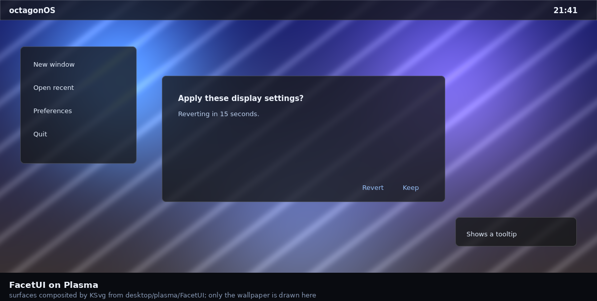

# FacetUI for Plasma

The Plasma style and colour scheme for octagonOS Desktop: the translucency and
the hairline that make a surface glass, and the colour scheme the rest of the
desktop is drawn in.



Every surface above is composited by **KSvg** — Plasma's own SVG engine, the
same one the desktop uses — from `FacetUI/`. Only the wallpaper is drawn by the
preview script, and only because a translucent surface over a flat colour looks
exactly like an opaque one.

## Where the three things come from

A surface is glass only if all three hold. They come from three different
places on this edition, and this is two of them.

| | |
|---|---|
| **Blur** | KWin's blur effect |
| **Translucency** | **here** — each surface's alpha, from `shared/facetui/palette.py` |
| **A boundary** | **here** — the hairline, one pixel at every surface edge |

The fourth piece, the specular edge and the rim, is the KWin effect in
[`../kwin`](../kwin). It assumes the other two are already true; without them it
lights a surface that is not glass.

## The tint is not written here

Plasma recolours a theme's SVGs by replacing a stylesheet with the live colour
scheme, so an element marked `class="ColorScheme-Background"` and filled with
`currentColor` takes the system's colour rather than one baked into the file.

That is the same rule the Android edition follows — *neutral-to-accent, not
dynamic-to-fixed* — expressed in the mechanism the platform already has. What
*is* written here is the alpha, so a dialog on the desktop is as translucent as
a dialog on the phone: both read `SURFACE_ALPHA` from
[`shared/facetui/palette.py`](../../shared/facetui/palette.py).

| Surface | Tier | Alpha | Content inset |
|---|---|---|---|
| `widgets/panel-background` | `shade` | 0.78 | 2 |
| `dialogs/background` | `dialog` | 0.769 | 8 |
| `widgets/background` | `dialog` | 0.769 | 8 |
| `widgets/tooltip` | `tooltip` | 0.761 | 6 |

The `solid/` variants are the no-compositing fallback and are honestly opaque.
FacetUI's own rule is that a translucent surface with nothing blurred behind it
is not glass, it is a dirty window.

## Building and installing

```sh
./make-plasma-theme.py
cp -r FacetUI ~/.local/share/plasma/desktoptheme/
```

Then pick **FacetUI** in System Settings → Colors and → Plasma Style.

## Checking it

```sh
../tools/verify-plasma-theme.py     # static: reads the SVGs
../tools/run-plasma-theme.sh        # renders every surface with KSvg
../tools/render-plasma-surfaces.py  # the picture above
```

The static pass reads the source. The rendering pass paints each surface twice,
over black and over white, and measures: the difference is the surface's real
alpha, and a row inside the top edge is the hairline. Neither is visible to a
parser, and an opaque dark surface looks exactly like a translucent one by eye.

Each check was proved to fail on the mistake it targets before being trusted:
eleven wrong themes for the static pass, seven for the rendering one.

## Nothing in this theme is stroked

That is not a style choice. It is two separate bugs, both measured, and it is
the rule the verifier enforces.

**A stroke on a repeated element.** Plasma tiles the four border elements to
fill a frame of any width. A stroke is centred on its path and antialiased on
both sides, so where two repeats meet, each contributes partial coverage to the
seam pixel and the two do not sum to one. The hairline came out at 12 against
40 at every repeat — a dotted line if you look closely, a clean one if you
don't.

**A stroke on a corner element.** Plasma sizes each element from its bounding
box, and a stroke makes that box larger than the geometry it decorates. The
whole tile is then squeezed to fit, leaving its last row and column
half-covered — a seam where the corner meets the two borders beside it. Over a
dark backdrop it reads as a dark notch; over a bright wallpaper, as a bright
one. Removing the stroke was what identified it: the seam went from 9 back to
17, the surface's own value.

A fill has exact edges and no bounds beyond its geometry. So the straight edges
are rectangles, and the corners are annular sectors.

## Other things that only showed when rendered

**Each corner is written out explicitly.** A general rounded-rectangle routine
produced the right path for the top-left and a leaf for the bottom-left — an
arc with the wrong sweep flag — and the mistake was invisible while a stroke
sat on top of it. The four corners are now four paths, and the probe checks
they cover the same area as each other.

**The margin has to clear the corner radius.** A rounded frame with a
one-pixel margin puts content inside the curve, where the surface has already
fallen away. It only shows at the corners, so it reads as a font problem.

**Adaptive transparency is off**, in `plasmarc`. It turns the panel opaque when
a window is maximised — a reasonable default for legibility, and the one moment
this theme most wants to be glass.

## Files

| | |
|---|---|
| `make-plasma-theme.py` | generates everything below |
| `FacetUI/metadata.json` | what System Settings lists |
| `FacetUI/colors` | the colour scheme, derived from the two accents |
| `FacetUI/plasmarc` | adaptive transparency, off |
| `FacetUI/{,solid/,translucent/}` | the surfaces, in three variants |
| `../tools/plasma-probe/` | the KSvg harness the rendering pass uses |
