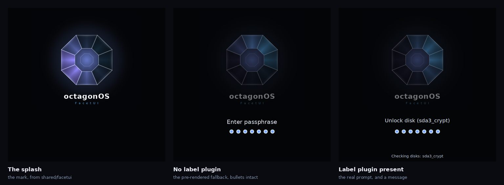

# The octagonOS Plymouth theme

The boot splash for octagonOS Desktop: the octagonOS mark, rendered from the
same FacetUI shader maths the Android boot animation uses, plus everything
Plymouth can ask a theme to put on screen during a boot.



Three real screenshots, taken by
[`../tools/run-plymouth-theme.sh`](../tools/run-plymouth-theme.sh) driving a
real `plymouthd`.

## Build and install

```sh
./make-plymouth-theme.py        # renders the frames, writes the theme
sudo ./install.sh               # installs, sets the default, rebuilds initramfs
```

`install.sh` runs the verifier first and refuses a theme that fails it.

**The initramfs rebuild is the step people skip.** Plymouth runs from the
initramfs, not from the root filesystem, so copying files into
`/usr/share/plymouth/themes` changes nothing about the next boot until the
initramfs is rebuilt to carry them.

## The passphrase prompt is the point

A boot theme that only draws an animation looks finished and is not. On a
machine with an encrypted disk, Plymouth asks the theme to display a passphrase
prompt; if the theme does not implement that callback, nothing is drawn. The
user sees an animation, types blind, and has no way to know the machine is
waiting for them. It is the most common way a custom boot theme ruins a
machine, and it is invisible until someone with LUKS boots it.

So the script implements, in this order:

| Callback | What it does |
|---|---|
| `display_password` | the prompt, and one bullet per character typed |
| `display_question` | the same for non-secret answers, shown in the clear |
| `display_message` | messages Plymouth wants shown — fsck progress, warnings |
| `display_normal` | **tears all of that down again** |
| `quit` | lets the mark resolve rather than vanishing mid-sweep |

`display_normal` is the one that is easy to forget, and forgetting it leaves a
stale passphrase prompt on screen for the rest of the boot.

### Two things that can go missing, and do

**The label plugin.** `Image.Text` needs `label.so` and a font present in the
initramfs. Without it, it returns nothing — so a theme that trusts it shows an
animation and no prompt. This is not hypothetical: the machine this theme was
developed on had no label plugin, so the fallback is the path that actually
ran, and the middle screenshot above is it. `show_prompt_text` measures the
image it built and falls back to a pre-rendered `prompt-fallback.png`
("Enter passphrase") when it came back empty. English-only and generic, which
is much better than silence.

**A font for the bullets.** They are images, not characters, for the same
reason: the bullets are the one piece of feedback telling a user their
keystrokes are registering, so they must not be the thing that goes missing.

## Checking it

```sh
../tools/verify-plymouth-theme.py          # static: reads the script
sudo ../tools/run-plymouth-theme.sh acc \
    "plymouth ask-for-password --prompt='Unlock disk' &" KEYS:hunter2 ENTER
```

The verifier is static and fast. The harness boots a real `plymouthd` against
`Xvfb`, types at it through XTEST, and screenshots every step — which is the
only way to find out that a callback never fires.

Every check in the verifier exists because the corresponding mistake was made
here, and each one was proved to fail on the bug it targets before being
trusted.

## What Plymouth does that is not obvious

Each of these cost a debugging session, and each reads as a different bug than
it is.

**Plymouth loads exactly one script** — the `ScriptFile` named in the
`.plymouth` config. A second `.script` in the theme directory is never read.
The frame counts started in their own file; `intro_count` was therefore
undefined, the frame-loading loop did nothing, and the theme drew its
background and stopped. The background appearing made it look as though the
script had run. `make-plymouth-theme.py` now prepends the counts into the one
script, and the verifier fails a theme with a second `.script` in it.

**Assignment is scoped by function.** Writing to a name that already exists
globally updates the global; writing to one that does not creates a
function-local that is destroyed on return. So

```
fun display_password(prompt, count) { bullets[0] = Sprite(); ... }
```

builds a sprite, draws nothing, and discards it — silently. The prompt appeared
and the bullets never did, which reads as a positioning bug. Every sprite and
image the callbacks use is now created at load; that is also the right thing on
a boot path, since nothing is allocated while the user is typing.

**`SetHideMessageFunction` never fires** on plymouth 24.004. The daemon logs
`hiding message ...` and the theme is never called back — verified by
registering a callback that did nothing but reveal a marker sprite and watching
it stay hidden while `SetDisplayMessageFunction` fired normally on the same
run. A theme that only clears on that callback leaves a stale "Checking disks"
over the rest of the boot. Messages here carry their own lifetime instead: each
new message resets it, and one nothing refreshes fades after about eight
seconds.

**Keyboard input comes from the renderer, not the tty.** With the x11 renderer
plymouth logs "Watching for keyboard input from renderer" and reads keys from
its X window, so writing to the pty passed to `--tty` reaches nothing. The
harness types through XTEST.

## Why the frames are smaller than Android's

Plymouth loads every image at script load, into an initramfs that is copied
into RAM at boot and whose size is charged to every boot on the machine. The
Android animation's 92 frames at 720×720 would be roughly 9 MB of initramfs for
a few seconds of animation. 54 frames at 384×384 is closer to 1.5 MB, which is
a proportionate thing to spend.

## Files

| | |
|---|---|
| `make-plymouth-theme.py` | renders the frames and writes the theme |
| `octagonos.script` | the theme logic, hand-written; the counts are prepended |
| `octagonos/` | the generated theme, as installed |
| `install.sh` | installs, sets the default, rebuilds the initramfs |
| `../tools/verify-plymouth-theme.py` | static checks |
| `../tools/run-plymouth-theme.sh` | runs it for real and screenshots it |
